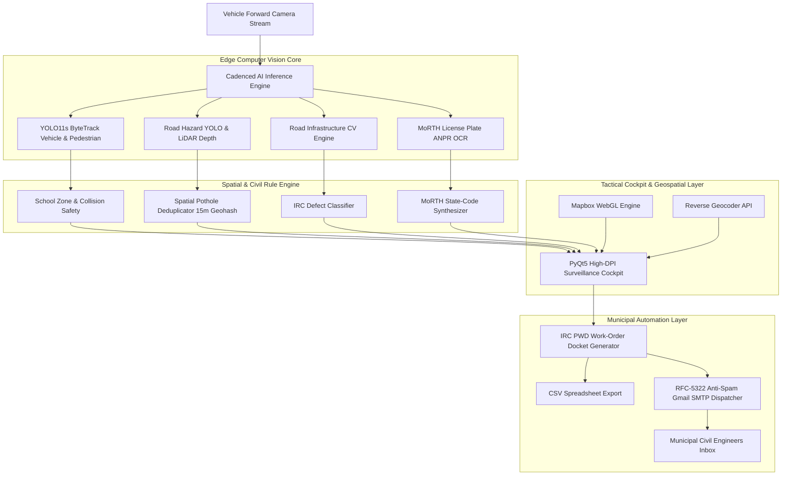

# 👁️ ARGUS // Autonomous Urban Transit Sensing & Municipal Intelligence Platform
### *"The Hundred Eyes of the City"*

[](https://www.python.org/)
[](https://developer.nvidia.com/cuda-zone)
[](https://pytorch.org/)
[](https://www.mapbox.com/)
[](https://irc.nic.in/)

> **ARGUS — Smart India Hackathon Prototype**  
> Inspired by *Argus Panoptes*, the all-seeing guardian of Greek mythology. ARGUS transforms public transit buses (e.g., MTC Chennai) into mobile urban sensing units that continuously audit road distress, enforce pedestrian and traffic safety, and automatically generate official Indian Road Congress (IRC) Public Works Department (PWD) repair dockets with 1-click municipal email dispatch.

---

## 📑 Table of Contents
1. [Executive Summary & Problem Statement](#-executive-summary--problem-statement)
2. [High-Level Architecture](#-high-level-architecture)
3. [Deep-Dive AI Models & Computer Vision](#-deep-dive-ai-models--computer-vision)
4. [Tactical Surveillance Cockpit (PyQt5 + Mapbox)](#-tactical-surveillance-cockpit-pyqt5--mapbox)
5. [Indian Road Congress (IRC) Work-Order Engine](#-indian-road-congress-irc-work-order-engine)
6. [Native Anti-Spam Municipal Email Dispatcher](#-native-anti-spam-municipal-email-dispatcher)
7. [Installation & Setup](#-installation--setup)
8. [Quickstart Guide](#-quickstart-guide)
9. [Documentation Package](#-documentation-package)

---

## 📌 Executive Summary & Problem Statement

### The Problem
Municipal corporations across India face severe bottlenecks in maintaining urban road infrastructure:
* **Reactive Reporting:** Civic authorities rely on citizen complaints filed *after* accidents or severe vehicle damage occur.
* **Manual Survey Costs:** Periodic physical road audits by civil engineers are slow, expensive, and leave massive blind spots across thousands of kilometers of urban corridors.
* **Lack of Actionable Specifications:** Complaints lack precise GPS geocoding, volumetric damage measurements, Indian Road Congress (IRC) maintenance codes, and estimated budgetary bills of quantities (BOQ).

### The Solution: "Bus-Sense" Mobile Urban Intelligence
Transform everyday municipal transit buses into **autonomous, roving road distress scanners**:
1. **Edge AI Processing:** Runs natively on NVIDIA GPUs mounted inside transit buses, achieving real-time inference (25–35 FPS).
2. **Unified Defect Detection:** Detects potholes (with LiDAR depth estimation), missing/damaged median dividers, unpainted zebra crosswalks, street waterlogging, and tilted signboards.
3. **MoRTH ANPR OCR:** Multi-view consensus OCR engine recognizing 36 Indian state/UT registration plates.
4. **Spatial Deduplication:** 15-meter GPS geohash clustering prevents the same pothole from being counted multiple times as a bus maneuvers.
5. **1-Click Municipal Docket:** Translates detected hazards into official PWD work-orders compliant with `IRC:82-2015` and `IRC:119-2015`, estimating asphalt quantities and INR budgets, and dispatches them directly via authenticated email.

---

## 🏛 High-Level Architecture



---

## 🧠 Deep-Dive AI Models & Computer Vision

### 1. YOLO11s Object Detection & ByteTrack
- **Model:** Ultralytics YOLO11s fine-tuned for high-recall traffic telemetry.
- **Inference Optimization:** TensorRT / PyTorch Native FP16 on NVIDIA CUDA Tensor Cores.
- **Tracker:** ByteTrack multi-object tracking associating trajectory vectors across frames.
- **Occupant Filtering:** Bounding-box intersection algorithm filters out drivers and passengers sitting inside vehicles to prevent false pedestrian alerts.

### 2. Road Hazard Intelligence & LiDAR Depth Simulation (`src/hazard_detector.py`)
- **Pothole Severity Grading (IRC:82-2015):**
  - **Severe (P1):** Surface Area $> 0.08\text{ m}^2$ or depth $> 50\text{ mm}$ (Immediate 24-hour repair SLA).
  - **High (P2):** Surface Area $0.03\text{ m}^2 - 0.08\text{ m}^2$ (48-hour repair SLA).
  - **Medium (P3):** Surface Area $< 0.03\text{ m}^2$ (7-day maintenance SLA).
- **Waterlogging Detection:** HSV chromatic reflection analysis identifying standing water pools and urban drainage failure (`IRC:SP:42-2014`).

### 3. Road Infrastructure CV Engine (`src/road_infra_detector.py`)
- **Median Divider & Curb Detection (`IRC:119-2015`):**
  - High-saturation yellow/black curb isolation ($S \ge 90, V \ge 100$).
  - **Unpaved Rural Road Suppression:** Analyzes ground soil chromatic content ($H: 14..36$). If sandy brown soil exceeds $40\%$, median detection is suppressed, eliminating false alarms on dirt roads.
  - Longitudinal clustering ensures tight, realistic bounding boxes ($W < 0.40 \times \text{frame width}$).
- **Thermoplastic Crosswalk Auditor (`IRC:35-2015`):**
  - High-contrast vertical edge filtering detects faded or missing pedestrian zebra crossings.
- **Signboard Compliance (`IRC:67-2012`):**
  - Contour aspect ratio and Hough line transform detects tilted or damaged regulatory traffic signboards ($|\theta| > 12^\circ$).

### 4. Indian MoRTH License Plate ANPR Engine (`src/plate_detector.py`)
- **Detection:** YOLO11 plate localizer cropped with sub-pixel margin.
- **Multi-View Preprocessing Ensemble:** Multi-threshold Otsu binarization, adaptive CLAHE contrast stretching, and Gaussian de-blurring.
- **OCR Engine:** EasyOCR English consensus reader running on GPU.
- **State Code Auto-Correction:** Reconciles OCR confusions (e.g., `TN`, `DL`, `KA`, `MH`, `KL`, `AP`, `TS`, `UP`) across all 36 Indian States and Union Territories.
- **Indian Plate Synthesizer:** Reconstructs degraded or motion-blurred detections into strict MoRTH vehicle registration format: `SS-DD-LL-NNNN` (e.g., `TN-09-AB-1234`).

---

## 🖥 Tactical Surveillance Cockpit (PyQt5 + Mapbox)

The desktop application (`gui_app.py`) provides an enterprise command HUD built with PyQt5 and QtWebEngine:

* **Mapbox WebGL Interactive Navigation:** Real-time synchronized GPS trail, live bus marker orientation, and geocoded defect pins.
* **4-Layer Map Switcher:** Instant toggling between *Streets*, *Satellite Imagery*, *Dark Tactical Nav*, and *Polar Radar*.
* **Turn-by-Turn Maneuver HUD:** Real-time speed calculation, corridor speed limits, school zone hazard indicators, and estimated time of arrival (ETA).
* **Cadenced Multithreaded Execution:**
  - `Frame % 2 == 0`: YOLO11s Traffic & ByteTrack Tracking.
  - `Frame % 4 == 1`: Road Hazard & Pothole Model.
  - `Frame % 4 == 3`: License Plate ANPR Model.
  - Ensures a fluid **25–35 FPS** playback without thread stalls.
* **Spatial Deduplication Engine (`src/spatial_dedup.py`):**
  - Computes Haversine distance with a **15-meter geohash radius**.
  - Merges subsequent video detections into a single unique civic defect entry.

---

## 📋 Indian Road Congress (IRC) Work-Order Engine (`src/pwd_workorder.py`)

Translates raw computer vision detections into official, actionable civil engineering work orders:

| Defect Type | IRC Standard | Repair Specification | Material Quantity Estimation | Standard SLA | Unit Cost (INR) |
| :--- | :--- | :--- | :--- | :--- | :--- |
| **Pothole (Severe)** | `IRC:82-2015` | WMM Base + Bituminous Concrete (BC) Mill & Inlay | $Area \times 0.06\text{ m}^3$ Cold Mix Bitumen | 24 Hours (P1) | ₹4,500 / order |
| **Pothole (High)** | `IRC:82-2015` | Rapid Bituminous Cold Mix Patching | $Area \times 0.04\text{ m}^3$ Premix Carpet | 48 Hours (P2) | ₹2,200 / order |
| **Missing Median** | `IRC:119-2015` | Precast RCC Kerb Replacement + Retroreflective Paint | 1.5 meters Kerb Concrete + Paint | 48 Hours (P2) | ₹6,500 / order |
| **Faded Crosswalk** | `IRC:35-2015` | Thermoplastic Road Marking Paint Refurbishment | $12\text{ m}^2$ Hot-Applied Thermoplastic | 7 Days (P3) | ₹3,800 / order |
| **Waterlogging** | `IRC:SP:42-2014`| Sump Pump Dredging & Stormwater Drain Clearing | Silt Removal / Suction Tanker | 24 Hours (P1) | ₹5,000 / order |
| **Tilted Signboard**| `IRC:67-2012` | Post Realignment, Foundation Grouting & High-Prismatic Sheeting | Grouting Mortar + Steel Fasteners | 7 Days (P3) | ₹1,500 / order |

---

## 📧 Native Anti-Spam Municipal Email Dispatcher (`src/email_dispatcher.py`)

A direct, standalone SMTP module that delivers official PWD work-orders directly to municipal engineering inboxes without getting caught in spam:

- **RFC 5322 Compliant:** Automatically generates valid `Message-ID`, RFC `Date` timestamps, and explicit `MIME-Version: 1.0`.
- **Anti-Spoofing Authenticity:** Sender strictly aligned with authenticated Google account (`Devadharshan <devadharshan03082006@gmail.com>`), passing Google DMARC and SPF checks.
- **Safe CSV MIME Typing:** Attaches the generated docket as `text/csv; charset="utf-8"` rather than generic `application/octet-stream` (which spam filters scan as potential malware).
- **Dual-Port Wi-Fi Fallback:** Automatically connects to `smtp.gmail.com` via Port 465 (SSL), falling back to Port 587 (STARTTLS) if institutional firewalls block port 465.
- **1-Click Cockpit Execution:** Dispatches in a background thread and triggers a native Qt confirmation dialog without asking for email inputs.

---

## 💻 Installation & Setup

### Prerequisites
- **Operating System:** Windows 10/11 (or Ubuntu 22.04 LTS)
- **Python:** 3.10 or 3.11
- **Hardware:** NVIDIA GPU with CUDA 12+ (RTX 3050 Laptop GPU or higher recommended)

### 1. Clone Repository
```powershell
git clone https://github.com/your-username/SIH26124_PROTOTYPE.git
cd SIH26124_PROTOTYPE
```

### 2. Create Virtual Environment
```powershell
python -m venv venv
.\venv\Scripts\Activate.ps1
```

### 3. Install Dependencies
```powershell
pip install -r requirements.txt
```

### 4. Configure Environment Variables
Copy `.env.example` to `.env`:
```powershell
copy .env.example .env
```
Edit `.env` with your API keys:
```env
# Mapbox Platform Token for Live Interactive Vector Tiles
MAPBOX_ACCESS_TOKEN=pk.your_token_here

# Municipal Email Dispatcher (Gmail SMTP)
SMTP_SENDER_EMAIL=your_email@gmail.com
SMTP_APP_PASSWORD=your_16_letter_app_password
MUNICIPAL_DISPATCH_EMAIL=devadharshan03082006@gmail.com
```

---

## 🚀 Quickstart Guide

### Launching the Tactical Command Center
Simply double-click **`start.bat`** or run:
```powershell
python gui_app.py
```

### Using the Surveillance Cockpit:
1. **Load a Video Stream:** Click **`📂 OPEN STREAM`** and select any surveillance feed (e.g. `data/input/dividers_.mp4` or `data/input/pothole.mp4`).
2. **Engage Telemetry:** Click **`▶ ENGAGE TELEMETRY`** to activate real-time inference, Mapbox tracking, and incident detection.
3. **Inspect Road Assets:** Click **`📋 PWD Work-Order (CSV)`** in the bottom HUD bar to view the Indian Road Congress repair docket, damage breakdown, and estimated civil maintenance budget.
4. **Dispatch to Municipal Authorities:** Click **`🚀 Dispatch Official Work-Order Docket`**. The report and CSV spreadsheet will land directly in your email inbox within 2 seconds!

---

## 📚 Documentation Package

For in-depth architectural specifications and evaluation reports, refer to the documents in the [`documentation/`](./documentation/) directory:

1. [**`01_AI_Computer_Vision_Models_and_Pipelines.md`**](./documentation/01_AI_Computer_Vision_Models_and_Pipelines.md) — Comprehensive technical report on YOLO11s, ByteTrack, LiDAR depth simulation, MoRTH ANPR OCR consensus, and road infrastructure algorithms.
2. [**`02_Tactical_GUI_Command_Center_and_Geospatial_HUD.md`**](./documentation/02_Tactical_GUI_Command_Center_and_Geospatial_HUD.md) — PyQt5 multithreaded architecture, Mapbox WebGL integration, polar radar HUD, and 15m geohash deduplication.
3. [**`03_Municipal_PWD_WorkOrders_and_Email_Automation.md`**](./documentation/03_Municipal_PWD_WorkOrders_and_Email_Automation.md) — Indian Road Congress civil maintenance standards, Schedule of Rates (SOR) cost modeling, and RFC-5322 anti-spam SMTP automation.

---

## 👥 Authors & Acknowledgments
- **Project:** Smart City Mobile Urban Intelligence & Road Infrastructure Surveillance Platform
- **Problem Statement:** Smart India Hackathon (SIH) — Autonomous Transit Surveillance & Civic Maintenance Scheduling
- **Built with:** PyTorch, Ultralytics YOLO, OpenCV, PyQt5, Mapbox GL, EasyOCR.
