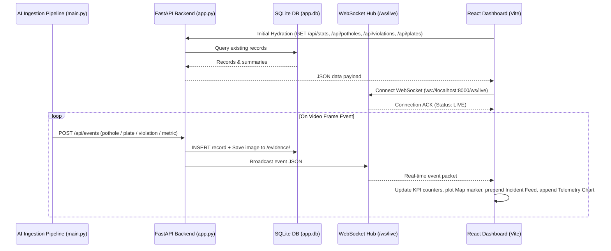

# Smart City Dashboard — System Design Specification

## 1. Overview
The Smart City Real-time Web Dashboard provides an interactive, live command-center interface for traffic monitoring, pothole detection, safety violation tracking, and vehicle license plate recognition. It pairs with the FastAPI backend via REST hydration and live WebSockets.

---

## 2. Architecture & Data Flow



---

## 3. Component Hierarchy

```
frontend/
├── src/
│   ├── components/
│   │   ├── Navbar.jsx          # Live connection badge, branding, clock, quick filters
│   │   ├── KpiRow.jsx          # 4 metric cards with animated counters & trend badges
│   │   ├── MapView.jsx         # Leaflet GIS map with custom markers, radius circles, popups
│   │   ├── IncidentFeed.jsx    # Real-time event cards with image evidence, timestamps, badges
│   │   ├── TrafficCharts.jsx   # Live telemetry charts (density over time, vehicle breakdown)
│   │   └── EvidenceModal.jsx   # Zoomed-in crop inspection modal with EXIF-like metadata
│   ├── services/
│   │   ├── api.js              # REST endpoints client (fetch / axios)
│   │   └── websocket.js        # Auto-reconnecting WebSocket client with event emitter
│   ├── index.css               # Clean Modern Dark-Slate design tokens & animations
│   ├── App.jsx                 # Main layout grid & global state container
│   └── main.jsx                # React root mount
```

---

## 4. UI Layout & Design Tokens

### Layout Wireframe
```
+-------------------------------------------------------------------------------------------+
| [LOGO] Smart City Command Center      [Status: ● LIVE] [FPS: 28.4] [Time: 20:25:30]       |
+-------------------------------------------------------------------------------------------+
| [Total Potholes: 24]  |  [Severe: 6]  |  [Critical Alerts: 3]  |  [Plates Scanned: 42]    |
+-------------------------------------------------------------------------------------------+
|                                              |                                            |
|                                              |   [Tab: Live Evidence Feed] [Tab: Charts]  |
|            INTERACTIVE LEAFLET MAP           |  +--------------------------------------+  |
|                                              |  | [IMG] #24 Severe Pothole (05.82s)    |  |
|     - Red Pins: Severe Potholes              |  |        MG Road Corridor | 92% Conf   |  |
|     - Yellow Pins: Shallow/Mild Potholes     |  |--------------------------------------|  |
|     - Purple Pins: School Zone Alert         |  | [IMG] Plate: KA-01-MJ-4021           |  |
|     - Cyan Pins: License Plate Scans         |  |        Car | Main Road | 88% Conf    |  |
|                                              |  |--------------------------------------|  |
|                                              |  | [IMG] #23 Mild Pothole (05.10s)      |  |
|                                              |  +--------------------------------------+  |
+-------------------------------------------------------------------------------------------+
```

### Aesthetic Theme Tokens (Clean Modern Slate)
- **Background**: `#0f172a` (Slate 900)
- **Card Surfaces**: `#1e293b` (Slate 800) with `#334155` border
- **Text Primary**: `#f8fafc` (Slate 50), Secondary: `#94a3b8` (Slate 400)
- **Severity Colors**:
  - Severe Pothole: `#ef4444` (Red 500)
  - Mild Pothole: `#f97316` (Orange 500)
  - Shallow Pothole: `#eab308` (Yellow 500)
  - Critical School / Hospital Alert: `#a855f7` (Purple 500)
  - License Plate: `#06b6d4` (Cyan 500)
  - Live Status: `#22c55e` (Emerald 500)

---

## 5. Error Handling & Edge Cases
1. **Backend Offline on UI Start**: Display clean banner ("Waiting for backend server on :8000..."), retry WebSocket connection every 2.5s with exponential backoff.
2. **Missing Evidence Images**: Display a fallback placeholder icon if the cropped image path fails to load.
3. **High Event Rate (>60 fps)**: Throttle chart updates to 500ms intervals using requestAnimationFrame / batching to prevent browser rendering lag.
4. **Zero GPS Coordinates**: Default map center to Bengaluru (`[12.9716, 77.5946]`) with appropriate initial zoom level (15).

---

## 6. Verification Plan
- **Automated / Unit**: Verify build passes cleanly (`npm run build`).
- **Interactive Verification**:
  1. Start backend: `python server.py`
  2. Start frontend: `npm run dev` in `frontend/`
  3. Run pipeline: `python main.py --input data/input/demo_traffic.mp4 --enable-potholes`
  4. Verify live map pins drop dynamically, evidence feed shows newly cropped images, KPI numbers increment, and charts plot real-time curves.
